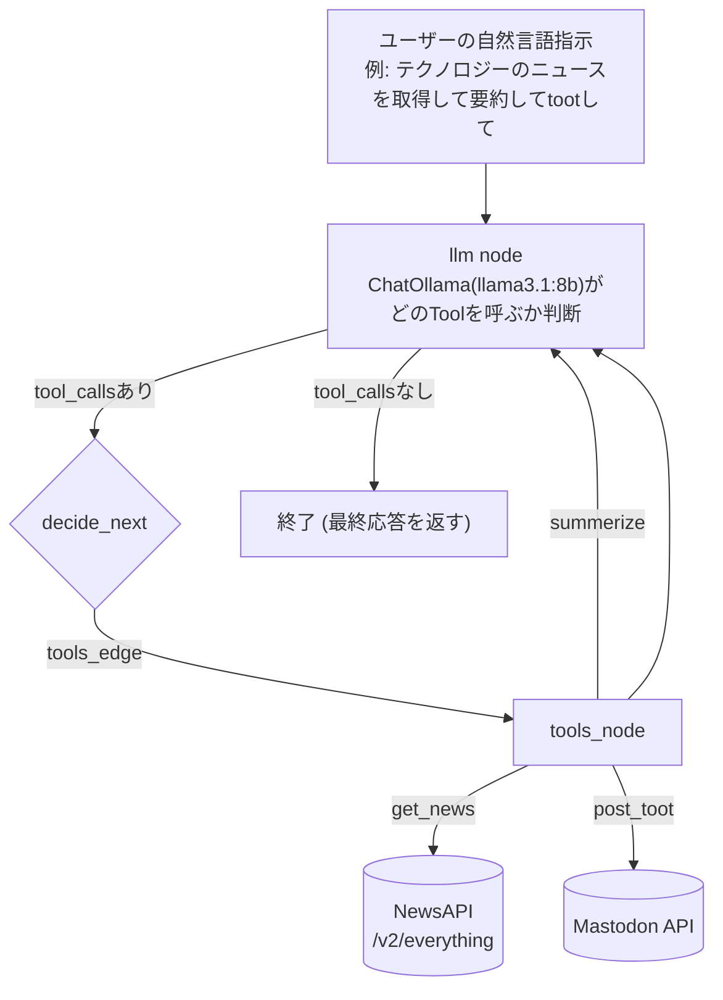

# news_sns_agent（NewsAPIのニュースをAIが要約し、Mastodonへ自動投稿するエージェント）

## 概要
- NewsAPIからキーワードに合致する最新ニュースを取得し、ローカルLLM（Ollama）で140字以内に要約したうえでMastodonに自動投稿するAIエージェントです。「テクノロジーのニュースを取得して要約してtootして」のような自然言語の指示を与えるだけで、ニュース取得→要約→投稿までを自動で実行します。
- LangChain/LangGraphの学習の一環として、四則演算を行うだけの最小構成のエージェント（`AI_agent_sns_news/udemy_langchain.ipynb`）から出発し、実用的なタスク（ニュース収集・SNS運用の自動化）に発展させる形で作成しました。

## デモ
（スクリーンショット・動作GIFをここに掲載予定）

## アーキテクチャ



処理の流れ：ユーザーの自然言語指示 → `llm`ノードがLLM（Ollama: llama3.1:8b）に問い合わせて次に呼ぶToolを判断 → `decide_next`でTool呼び出しの有無を条件分岐 → `tools_node`が`get_news`（NewsAPI取得）・`summerize`（要約）・`post_toot`（Mastodon投稿）のいずれかを実行 → 結果を`llm`ノードに戻して次の判断へ（ループ）→ Tool呼び出しが不要になった時点で終了、という一連の流れをLangGraphの`StateGraph`で明示的に構築しています。

なお`langgraph.json`でグラフ（`news_agent`）を定義しているため、`langgraph dev`コマンドでLangGraph Studioからグラフの状態遷移を可視化しながら実行・デバッグできます。

## 技術スタックと選定理由
- **言語**: Python
- **エージェントフレームワーク**: LangGraph（`StateGraph` / `MessagesState` / `ToolNode`）— 高レベルAPIの`create_agent`（`langchain.agents`）も検証しましたが、ツール呼び出しの分岐や状態遷移を自分でグラフとして明示的に定義できるLangGraphの方が処理の流れを追いやすく、デバッグや拡張がしやすいと判断し採用しました。
- **LLM**: Ollama経由のローカルLLM（`llama3.1:8b`）— 要約タスクにAPI課金の発生しないローカルLLMを使うことで、繰り返し実行時のコストを抑えています（Gemini APIでの実装もノートブック上で検証済み）。
- **ニュース取得**: [NewsAPI](https://newsapi.org)（`/v2/everything`エンドポイント）
- **SNS投稿**: [Mastodon.py](https://mastodonpy.readthedocs.io/)（`mastodon.social`へのtoot投稿）— X（Twitter）APIの利用ハードルを避け、オープンなMastodon APIを採用しました。
- **トレーシング**: LangSmith — エージェントがどのToolをどんな引数で呼び出したかを可視化し、デバッグに利用しています。
- **HTTPクライアント**: httpx
- **環境変数管理**: python-dotenv

## 工夫した点・苦労した点
- **Tool呼び出しループの制御**: `decide_next`関数で直近メッセージに`tool_calls`が含まれるかどうかを判定し、含まれていれば`tools_node`へ、なければ終了へ分岐させることで、1回のユーザー指示から`get_news`→`summerize`→`post_toot`という複数Toolの連鎖呼び出しを実現しました。
- **create_agentとLangGraphの使い分け**: 最初は`create_agent`で簡易実装しましたが、内部の処理フローがブラックボックス化されるため、最終的には`StateGraph`でノードとエッジを明示的に定義し直しました（検証過程は`udemy_langchain.ipynb`に記録）。
- **ローカルLLMの接続設定**: Ollamaのデフォルトポート（11434）ではなく`base_url="http://localhost:12000"`で待ち受ける環境だったため、接続先を明示的に指定する必要がありました。

## セットアップ方法
```bash
git clone git@github.com:yasaka-takumi/news_sns_agent.git
cd news_sns_agent/AI_agent_sns_news

# 依存パッケージのインストール
pip install -r requirements.txt

# ローカルLLM（Ollama）をポート12000で起動し、モデルを取得
OLLAMA_HOST=0.0.0.0:12000 ollama serve &
ollama pull llama3.1:8b

# .env を作成（AI_agent_sns_news/ 配下に配置）
cat <<'EOF' > .env
NEWS_API_KEY=your_newsapi_key        # https://newsapi.org で取得
ACCESS_TOKEN_API_KEY=your_mastodon_access_token  # Mastodonアプリのアクセストークン
LANGSMITH_API_KEY=your_langsmith_key # 任意（トレースを使う場合）
EOF

# LangGraph Studio 経由で起動し、グラフを確認しながら対話的に指示を送る
langgraph dev
```
`langgraph dev`起動後、Studio UIまたはAPI経由で`news_agent`グラフに「〇〇のニュースを取得して要約してtootして」のようなメッセージを送ると、ニュース取得→要約→Mastodon投稿が実行されます。
